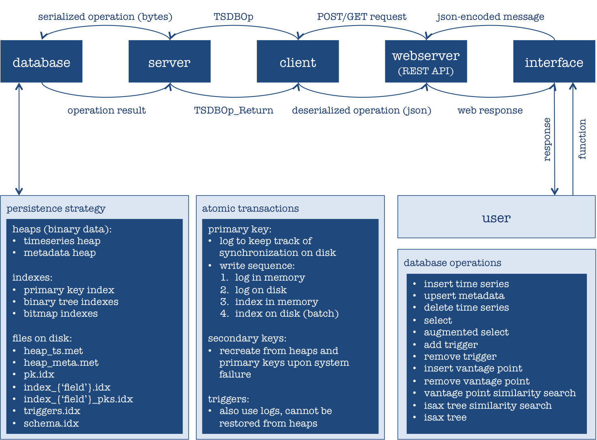

Mynti207
================================================


Persistent Time Series Database
------------------------------------------------

[](https://travis-ci.org/Mynti207/cs207project) [](https://coveralls.io/github/Mynti207/cs207project?branch=master)


**Note:** Unit tests are carried out by loading the server and webserver as sub-processes, which are not reflected in the coverage statistics. We estimate that our unit tests achieve at least 90% coverage when taking into consideration code that is run via sub-processes.


Description
-----------

This package implements a persistent time series database. Our sample use case involves two types of similarity searches on daily stock market data.





### Persistence Architecture

**Heaps**

The timeseries and the metadata are stored in heap files. When loading or creating a database, the heap files are opened and every operation occurs in the heap. The data are formatted with the python `struct` library and saved in the two following binary files.

- `TSHeap` to store the raw timeseries

All the timeseries stored need to have the same length (this parameter is set when opening a database and is checked when inserting new timeseries). This length is stored at the begining of the heap, followed by each timeseries as the encoded concatenation of the times and values sequences. The offset of each timeseries is stored in the `PrimaryIndex` `pks` of the `PersistentDB` object. In case of a deletion, the offset is removed from the indexes and the `deleted` metadata field associated with the time series is updated.

- `MetaHeap` to store the metadata:

For each timeseries that is inserted, all the fields of the schema are initialized to their default values and saved into the heap. The size of each `struct` is directly computed from the schema and is common to each time series' metadata. In case of deletion/insertion into the schema, the heap file is reset with the new `struct` for all the metadata. This design decision causes heavy computation, but it rarely occurs (only upon insertion/deletion of vantage points) and allows a memory optimized heap file to be maintained. The offset of each element is stored in the `PrimaryIndex` associated with the corresponding time series' primary key.


**Indices**

A primary index is used by default on the primary key (which is a string type in the current implementation) and stores the offsets for the heap files. Additional indexes can be set by the user on schema fields. This field can take 3 different values: `1` for a Binary Tree index in case of high cardinality, `2` for a BitMap index in case of low cardinality and `None` if no index is required.
The following indexes are saved on disk with pickle and inherit from the same `Index` class:

- `PrimaryIndex`: stores the primary index in a dictionary using the following format: 
```python
{'pk': ('offset_in_TSHeap', 'offset_in_MetaHeap')}
```

- `BinaryTreeIndex`:
  uses the Python `bintrees` library (https://pypi.python.org/pypi/bintrees/2.0.2).

- `BitMapIndex`:
  uses a dictionary with possible values as keys and bitmap vectors over the timeseries as values.

  e.g. if `pk1` and `pk2` are `1`, `pk3` is `2`, and `pk4` is `3`, then the index will be ``{1: '1100', 2: '0010', 3: '0001'}``

- `TriggerIndex`: uses a dictionary with possible trigger actions as keys and a list of tuple as values, where each tuple represents the parameters of a trigger associated with the given database action.

**Files saved on disk**

All the following files are saved in the local directory `data_dir` under the sub-directory `db_name`, which is an attribute of the PersistentDB object:

- `TSHeap`
  `heap_ts` stores the raw timeseries sequentially in a binary file, with `ts_length` stored at the beginning of the file.

- `MetaHeap`
  `heap_meta` stores all the metadata fields in a binary file.

- `PrimaryIndex`
  `pk.idx`

- `BinaryTreeIndex`
  `index_{'field'}.idx`

- `BitMapIndex`
  `index_{'field'}.idx` (bitmap encoding) and `index_{'field'}_pks.idx` (for conversion to/from bitmap)

- `TriggerIndex`

  `triggers.idx`

**Atomic transactions**

**TODO**


### Additional Feature: iSAX Similarity Searches

A time series of fixed length can be reduced in dimensionality using a SAX encoding. The collective encodings for a time series can be used to index multiple time series, which can then be represented by an iSAX tree (see, e.g. [http://www.cs.ucr.edu/~eamonn/iSAX_2.0.pdf](http://www.cs.ucr.edu/~eamonn/iSAX_2.0.pdf)). This tree structure effectively clusters "similar" time series according to some distance measure, such as
Euclidean distance.

We implemented a modified version of the iSAX tree using a true n-ary tree structure (i.e. n splits are permitted at all internal nodes rather than the binary splits of a typical iSAX tree), thus alleviating certain balancing concerns associated with the original iSAX tree model. Database functionality that utilizes the iSAX tree structure includes returning a time series that is similar to an input time series, as well as outputting a hierarchical representation of the contents of the iSAX tree that illustrates the clustering of similar time series as indexed by the tree.


### REST API

**TODO**


## Technical Details

### Installation

The package can be installed by running `python setup.py install` from the root folder.

Installation will make the following packages available: `procs`, `pype`, `timeseries`, `tsdb` and `webserver`.

**Note**: Python 3.5 is required for this package.


### Running the Server
The database server can be loaded by running `python go_server_persistent.py` (with the appropriate arguments), followed by `python go_webserver.py`. It is good practice to pause for a few seconds after each of those commands, to ensure that the server/webserver has loaded fully. Please refer to our documentation for examples and more detailed instructions.

For example, `python go_server_persistent.py --ts_length 244 --db_name 'stock_prices'` followed by `python go_webserver.py` will load our database of daily stock price data, which includes a year of daily price data for 379 S&P 500 stocks (source: [www.stockwiz.com](http://www.stockwiz.com)).

We recommend using our web interface to interact with the REST API. Available functions, each of which represents a database operation, are listed below. Our database function demonstration provides more detail on how to load and use the web interface to interact with the REST API.


### Functions
* `insert_ts`: Insert time series data. May be followed by running a pre-defined function (trigger), if previously specified.
* `upsert_meta`: Upsert (insert/update) time series metadata.
* `delete_ts`: Delete time series data and all associated metadata.
* `select`: Perform select (query) of time series data and/or metadata.
* `augmented_select`: Perform augmented select (query, followed by a pre-defined function) of time series data and/or metadata.
* `add_trigger`: Add a trigger that will cause a pre-defined function to be run upon execution of a particular database operation (e.g. calculate metadata fields after adding a new time series).
* `remove_trigger`: Remove a trigger associated with a database operation and a pre-defined function.
* `insert_vp`: Add a vantage point (necessary to run vantage point similarity searches).
* `delete_vp`: Remove a vantage point and all associated data.
* `vp_similarity_search`: Run a vantage point similarity search, to find the closest (most similar) time series in the database.
* `isax_similarity_search`: Run an iSAX tree-based similarity search, to find the closest (most similar) time series in the database. This is a faster search technique, but it only returns an approximate answer and may not always find a match.
* `isax_tree`: Visualize the iSAX tree.

Please refer to our database function demonstration below for full details on the function signatures and usage.


### Examples
* [Database function demonstration](docs/demo.ipynb)
* [Database persistence demonstration](docs/persistence_demo.ipynb)
* Stock market examples: [daily stock prices](docs/stock_example_prices.ipynb) | [daily stock returns](docs/stock_example_returns.ipynb)


Developers
----------

Gioia Dominedo  |  [@dominedo](https://github.com/dominedo)  |  dominedo@g.harvard.edu

Nicolas Drizard  |  [@nicodri](https://github.com/nicodri)  |  nicolasdrizard@g.harvard.edu

Kendrick Lo  |  [@ppgmg](https://github.com/ppgmg)  |  klo@g.harvard.edu
